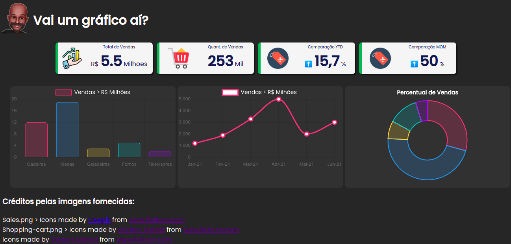

# Chart.js > Protótipo > Utilizando a biblioteca chart.js para geração de gráficos

## 1) Demonstração:

## 2) Techs - Tecnologias envolvidas:

* [x] Chart.js
* [x] Javascript
* [x] HTML
* [x] CSS

## 3) Author:

**Ricardo de Almeida**